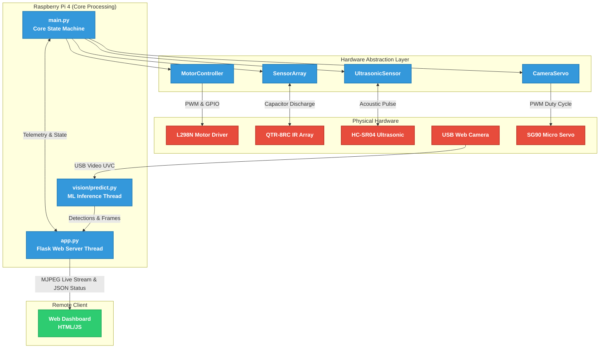
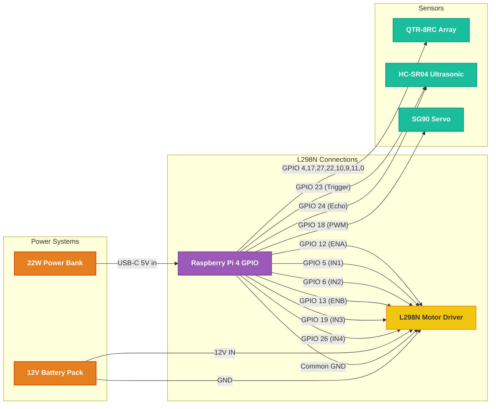

# Autonomous Line Follower and Obstacle Avoidance Rover
## Final Project Report & Documentation

---

## 1. System Architecture
The robot operates on a multi-threaded architecture leveraging the **Raspberry Pi 4**. It processes physical sensor data in real-time for navigation while simultaneously running a machine learning inference pipeline and an asynchronous web server for remote telemetry.



---

## 2. Circuit Schematics & Component Connections

The following diagram maps the logical connections from the Raspberry Pi GPIO header to all physical peripherals. The robot utilizes **Dual Power Supplies** to isolate heavy inductive motor noise from the Raspberry Pi's sensitive logical voltage.

### Wiring Diagram


---

## 3. Bill of Materials (BOM)

### Primary Hardware Components
| Item | Description | Purpose |
| :--- | :--- | :--- |
| **Raspberry Pi 4 Model B** | 4GB/8GB RAM Variant | The core brain orchestrating the Python state machine, ML inference, and Flask web server. |
| **L298N Motor Driver** | Dual H-Bridge DC Motor Controller | Translates 3.3V GPIO logic signals into high-current 12V power for the DC motors. |
| **DC Gear Motors (x2)** | Standard Yellow TT Motors | Provides locomotion. Driven by the L298N using 100Hz PWM for maximum torque. |
| **QTR-8RC Sensor Array** | 8-Channel Reflectance Sensor | High-precision infrared array used for PID line following and '+' intersection detection. |
| **HC-SR04 Ultrasonic Sensor** | Acoustic Distance Sensor | Detects physical obstacles up to 15cm ahead to trigger the avoidance maneuver. |
| **Lapcare USB Web Camera** | Standard UVC Video Device | Captures video frames at 640x480 for the ML pipeline, PyZbar QR decoding, and the dashboard. |
| **SG90 Micro Servo** | 180-Degree PWM Servo Motor | Rotates the Web Camera (-45°, 0°, +45°) to scan the peripheral environment at checkpoints. |
| **12V Battery Pack** | Li-Po / 18650 Battery Array | Provides high-current power directly to the L298N Motor Driver terminals. |
| **5V USB Power Bank** | 22W Fast Output | Powers the Raspberry Pi independently to prevent voltage brownouts when motors draw stall-current. |

### Auxiliary Hardware
| Item | Description | Purpose |
| :--- | :--- | :--- |
| **Robot Chassis** | Acrylic  Frame | Houses all components securely to withstand sudden torque changes. |
| **Jumper Wires** | Male-Fem / Fem-Fem | Connects the Raspberry Pi GPIO pins to the L298N, QTR array, and Ultrasonic sensors. |

---

## 4. Software Structure and Usage

The codebase is organized modularly to separate hardware control, computer vision, web serving, and the core operational state machine.

### Directory Tree
```text
AutonomousRover/
├── main.py                  # Brain of the robot: orchestrates PID loop, avoidance, and threads
├── config.py                # Centralized hardware mappings, pins, and behavioral constants
├── app.py                   # Flask server providing the Web Dashboard UI and MJPEG stream
├── hardware/                # Hardware Abstraction Layer
│   ├── motors.py            # L298N driver with deadband friction clamps & kick-start
│   ├── sensors.py           # IR Array discharge timing & Ultrasonic polling
│   └── servo.py             # PWM positioning for the camera mount
├── vision/                  # Perception Pipeline
│   └── predict.py           # Multi-threaded OpenCV + TFLite inference + PyZbar QR decoding
├── ml_pipeline/             # AI Training
│   ├── train_model.py       # MobileNetV2 Transfer Learning script generating the .tflite model
│   ├── rover_vision_model.tflite # The compiled inference engine
│   └── labels.json          # Detected image class labels maps
├── templates/               # Web Application Assets
│   └── index.html           # The responsive Dashboard Interface
└── deploy.sh                # Main Linux environment setup script
```

### Usage Instructions
1. **Physical Power-Up**: Connect the 12V supply to the L298N, and the 5V power bank to the Raspberry Pi. 
2. **Auto-Boot**: The robot is configured via `crontab` to execute `sudo python3 /home/botdesign/AutonomousRover/main.py` exactly 15 seconds after network connection.
3. **Execution**: The robot will sequentially initialize the I2C/GPIO, load the TFLite neural network onto CPU memory, spawn the Web Camera background thread, and begin analyzing IR sensor floor reflections.
4. **Monitoring**: View the live diagnostic feed by opening a web browser on the same network to `http://<RASPBERRY_PI_IP>:5000`.

---

## 5. Third-Party Libraries & Dependencies

The complete Python environment requires the following packages. They are installed globally on the Raspberry Pi via standard `pip` wheels optimized for ARM64 structure constraint (`--break-system-packages` override used on Ubuntu 24.04).

| Library | Version / Constraint | Application in Project |
| :--- | :--- | :--- |
| **Flask** | `>=2.3.2` | Delivers the asynchronous Web server and streams the MJPEG frames via multipart responses. |
| **NumPy** | `>=1.25.0` | Matrix mathematics backend supporting OpenCV matrix manipulations and TFLite tensor reshaping. |
| **OpenCV-Python** | `opencv-python-headless>=4.8.0` | Grabs camera frames, resizes standard aspects (224x224), and encodes `.jpg` bytes for network streaming. Headless variant excludes heavy GUI dependencies. |
| **PyZbar** | `>=0.1.9` | Specialized secondary vision decoder ensuring rapid, rotation-invariant QR parameter extraction. |
| **TensorFlow** | `tensorflow>=2.21.0` | Google's Machine Learning framework. The Pi uses its subset Interpreter to run the `.tflite` model fast on the ARM CPU without a discrete GPU. |
| **RPi.GPIO** | `>=0.7.1` | The lowest-level hardware memory interface. Controls pin voltage logic, Software PWM (Pulse Width Modulation), and microsecond precision timing loops for the capacitor discharge sensors. |
